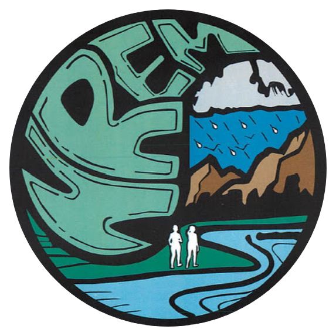

# Assessing Current and Future Ocean Acidification and Climate Vulnerabilities Along the Hawaiian Archipelago

 

 

This work is the result of research funded by the National Oceanic and
Atmospheric Administration’s Ocean Acidification Program under award
<strong>NA21OAR0170191</strong> to the University of Hawaiʻi at Mānoa.

© 2025 University of Hawaiʻi at Mānoa. All rights reserved.  
Developed by [Oleson Lab Team](https://www.olesonlab.org/)

Designed by [BootstrapMade](https://bootstrapmade.com/) \| Distributed
by [ThemeWagon](https://themewagon.com)

